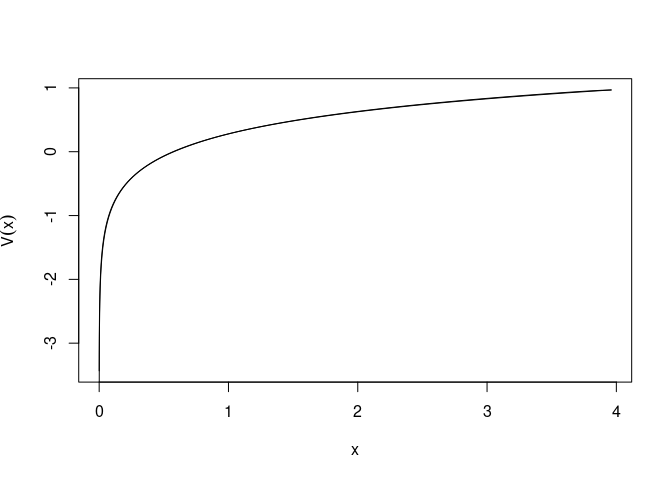
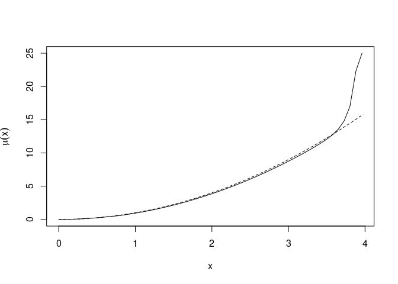
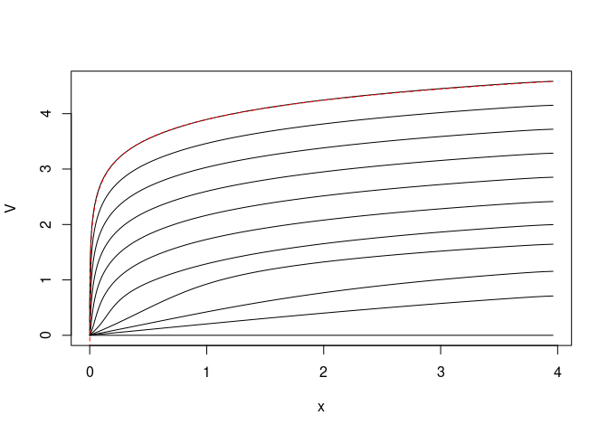
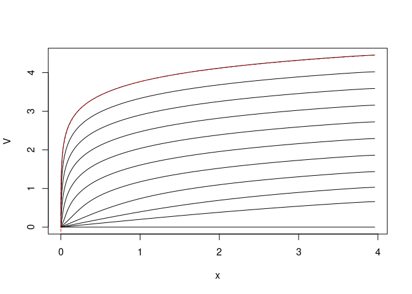

## Fisheries as optimal control

We consider the problem of optimal harvest of a fish stock. Our
objective in this vignette is to demonstrate the numerical solution of
the optimal control problem. The controlled system dynamics are

*d**X*<sub>*t*</sub> = \[*X*<sub>*t*</sub>(1−*X*<sub>*t*</sub>)−*U*<sub>*t*</sub>\] *d**t* + *σ**X*<sub>*t*</sub> *d**B*<sub>*t*</sub>

Here, *X*<sub>*t*</sub> is the biomass, and *B*<sub>*t*</sub> is
standard Brownian motion. The term
*X*<sub>*t*</sub>(1−*X*<sub>*t*</sub>) is the growth without fishing,
i.e. logistic growth; we have made time and abundance dimensionless.
*U*<sub>*t*</sub> is the harvest rate. We aim to maximize $\sqrt{U_t}$
in steady state, which leads to the Hamilton-Jacobi-Bellman equation

$$
\sup\_{u\geq 0} \left\[ \dot V + x(1-x) V' - uV' + \frac 12 \sigma^2 x^2 V'' + \sqrt u \right\] = 0 . 
$$

The optimal control is found as a stationary point:
*u* = 1/4/(*V*′)<sup>2</sup>.

The analytical steady-state solution to this problem is,
$$
  V(x,t) = \frac 12 \log x -\gamma t
$$
where $\gamma = \frac 12 (1-\sigma^2 /2)$. This leads to the strategy
*U*<sub>*t*</sub> = *X*<sub>*t*</sub><sup>2</sup>.

## Numerical analysis of the steady-state problem

We aim to verify the analytical solution numerically. We first set up
the model, writing it in advection-diffusion form. We use
*D* = *g*<sup>2</sup>/2 as the diffusivity and *v* = *f* − *D*′ as the
advective field.

``` r
require(SDEtools)
```

    ## Loading required package: SDEtools

``` r
sigma <- 0.5

f <- function(x) x*(1-x)
g <- function(x) sigma*x

dg <- function(x) sigma
D <- function(x) 0.5*g(x)^2
dD <- function(x) g(x)*dg(x)
v <- function(x) f(x) - dD(x)
```

The following function gives the optimal control as a function of *x*
and *V*′(*x*):

``` r
mu <- function(x,Vp) 0.25/Vp^2
```

We now discretize the problem. We use a grid which is more dense near
the origin.

``` r
Xmax <- 4
xi <- seq(0,sqrt(Xmax),length=101)^2    # Interfaces between grid cells
xc <- 0.5*(head(xi,-1)+tail(xi,-1))     # Center of grid cells
```

We first define the generator without fishing:

``` r
G0 <- fvade(v,D,xi,'r')
```

    ## Loading required package: Matrix

and next the generator corresponding to fishing:

``` r
G1 <- fvade(function(x)-1,function(x)0,xi,'r')
```

Note that this discretizes the operator *V* ↦  − *V*′.

We are now almost ready to solve the steady-state problem using policy
iteration. But first, to make the nummerics more robust, we make two
changes: First, at the left cell, we assume that we cannot fish. This
avoids the option of driving the fish to extinction and then fish like
crazy on fish that aren’t there. Next, we assume that there is a bound
on the harvest, even if *V*′(*x*) = 0. We do that by replacing *V*′(*x*)
with max (*ϵ*,*V*′(*x*)) where *ϵ* is a “small” number.

``` r
epsilon <- 1e-1
uopt <- function(G1V) 
  {
     u <- mu(xc,pmax(epsilon,-G1V))
     u[1] <- 0
     return(u)
  }
```

Finally, we need the pay-off:

``` r
  k <- function(u) sqrt(u)
```

We can now solve the steady-state problem using policy iteration:

``` r
  sol <- PolicyIterationSingular(G0,G1,k,uopt,do.minimize=FALSE)
```

We plot the policy and the value function compared with the analytical
results:

``` r
  plot(xc,sol$V,type="l",xlab="x",ylab=expression(V(x)))
  lines(xc,0.5*log(xc) - 0.5*log(xc[50]) + sol$V[50])
```



Note the excellent agreement. Similarly, for the control:

``` r
  plot(xc,sol$u,type="l",xlab="x",ylab=expression(mu(x)))
  lines(xc,xc^2,lty="dashed")
```


Note that there is some discrepancy at the upper boundary, where the
discretized problem fishes really hard to avoid the risk of hitting the
boundary, which would be wasteful.

We finally plot the stationary distribution of the state under the
time-invariant control.

``` r
  plot(xc,sol$pi,type="l",xlab="x",ylab="p.d.f.")
```



## The time-varying problem

Here, we demonstrate how to solve the time-varying HJB equation by time
marching. There is no particular reason to do this for this problem, but
one could imagine extensions where system parameters vary with time etc.
Therefore we include this.

The time-varying problem runs in a backward iteration. We set up arrays
for the value function and for the optimal harvest. Here, the row index
corresponds to the state, while the column index corresponds to the
time. We fill in the last column of *V* with the terminal condition,
which we take to be all 0.

``` r
T <- 10
dt <- 1

tv <- seq(0,T,dt)

V <- U <- array(NA,c(length(xc),length(tv)))
V[,length(tv)] <- 0
```

The backward iteration works in two steps: First, we use *V*(⋅,*t*) to
identify the optimal control *μ*(*x*). This is specific to the current
time step but our notation suppresses this. Next, we assume that this
control strategy is applied during the preceding time interval. To this
end, we write the equation in the value function as
*V̇* + *G*<sub>*c**l*</sub>*V* + *k* = 0
where *G*<sub>*c**l*</sub> is the closed loop generator, and *k* is the
running reward with the current control strategy. For our example,
*G*<sub>*c**l*</sub> discretizes the operator
$$
x(1-x)V' - \mu(x)V' + \frac 12 \sigma^2 V'' 
$$
where *μ*(*x*) is fixed. Similarly, *k* is a vector that evaluates
$\sqrt{\mu(x)}$.

To solve this equation exactly, i.e., without time discretization error,
we write it as a coupled system *k̇* = 0 and solve the combined system.
Let *Z* = (*V*,*k*), then
$$
- \dot Z = \left\[ \begin{array}{cc} G\_{cl} & I \\ 0 & 0 \end{array} \right\] Z
$$
We solve this system using the matrix exponential. The top half elements
is the solution at the previous time step.

``` r
OO <- sparseMatrix(i=numeric(0),j=numeric(0),x=0,dims=c(length(xc),2*length(xc)))

for(i in length(tv):2)
{
  ## Find optimal control strategy
  u <- uopt(G1 %*% V[,i])
  U[,i-1] <- u
  
  ## Construct the "closed loop" system that results from applying this control strategy
  Gcl <- G0 + Diagonal(x=u) %*% G1
  
  GG <- rbind(cbind(Gcl,Diagonal(n=length(xc),x=1)),OO)
  Vkterm <- c(V[,i],k(u))
  Vksol <- expm(GG*dt) %*% Vkterm
  V[,i-1] <- Vksol[1:length(xc)]
}
```

The following plot shows the value function at the various points in
time. Notice that it quite quickly seems to enter a steady state where
the value function is just shifted the same amount from each time step
to the previous. This reflects that the problem effectively is in steady
state here: The control horizon is long compared to the mixing time of
the controlled process. The shift corresponds to *γ*, the pay-off rate
in steady state. The red line is the analytical result from the
steady-state problem.

``` r
matplot(xc,V,type="l",col=1,lty=1,xlab="x")
lines(xc,0.5*log(xc)-0.5*log(xc[50])+V[50,1],lty="dashed",col="red")
```



The following contour plot shows the optimal control as a function of
time and state. Note that we fish hard when we are close to the terminal
time, since this problem does not include a terminal reward for leaving
fish in the system at the end of time.

``` r
contour(tv,xc,t(U),levels=seq(0,3,0.25)^2,xlab="t",ylab="x")
```


## Implicit Euler time stepping

The matrix exponential in the previous is expensive for large problems.
So therefore we give here a variant of the code which uses implicit
Euler to time step the HJB equation rather than the matrix exponential.
The equation is time discretized as

$$
\frac 1h (V_t - V\_{t-h} ) + G\_{cl} V\_{t-h} + k = 0
$$

i.e.,

*V*<sub>*t* − *h*</sub> = (*I*−*G*<sub>*c**l*</sub>*h*)<sup>−1</sup>(*V*<sub>*t*</sub>+*h**k*)

``` r
for(i in length(tv):2)
{
  ## Find optimal control strategy
  u <- uopt(G1 %*% V[,i])
  U[,i-1] <- u
  
  ## Construct the "closed loop" system that results from applying this control strategy
  Gcl <- G0 + Diagonal(x=u) %*% G1
  
  V[,i-1] <- as.numeric(solve(Diagonal(n=length(xc),x=1) - Gcl*dt,V[,i] + dt*k(u)))
}
```

We repeat the two previous plots. Note that the transients are slightly
different due to the coarse time step, but that the steady state is the
same.

``` r
matplot(xc,V,type="l",col=1,lty=1,xlab="x")
lines(xc,0.5*log(xc)-0.5*log(xc[50])+V[50,1],lty="dashed",col="red")
```



``` r
contour(tv,xc,t(U),levels=seq(0,3,0.25)^2,xlab="t",ylab="x")
```


